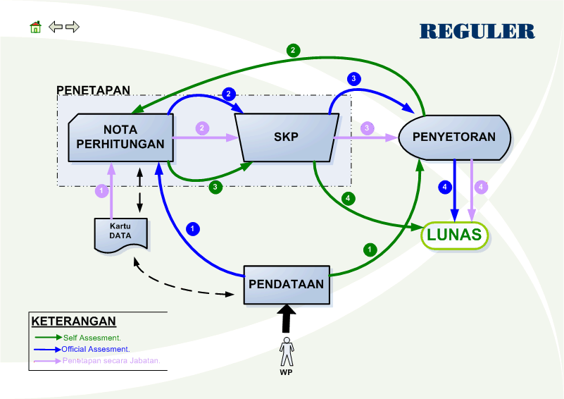
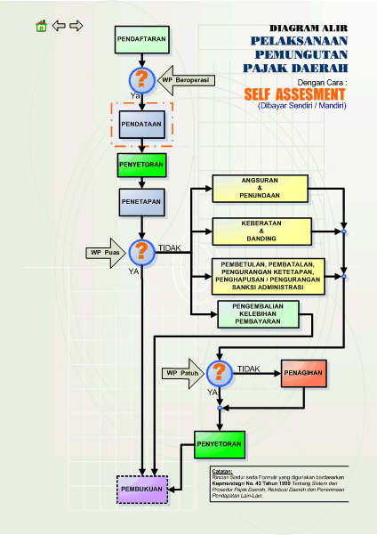
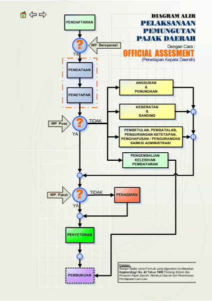
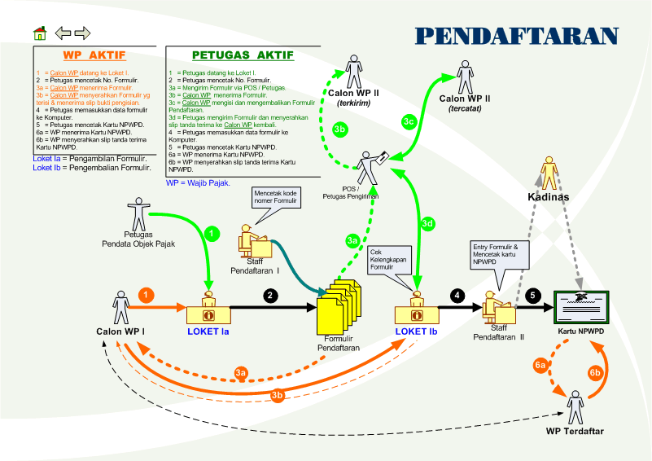
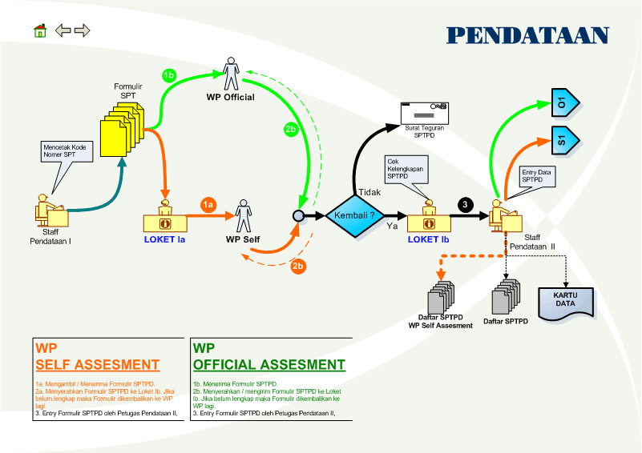
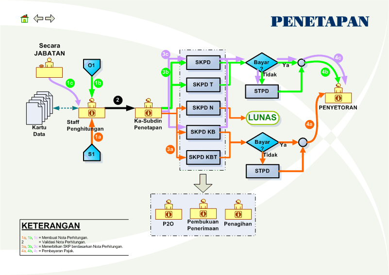
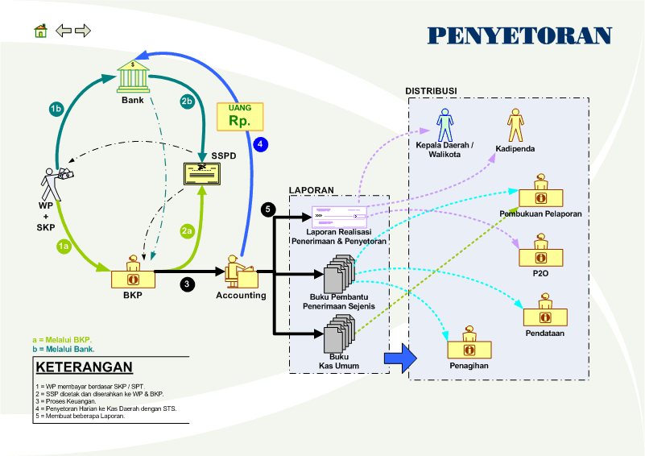

**SIMPATDA** adalah Sistem informasi yang mengelola data yang berkaitan dengan pajak dan retribusi daerah. Sistem ini akan mengorganisasikan data wajib pajak/retribusi, perhitungan perpajakan, serta pelaporan hasil-hasil pungutan pajak/retribusi.

Sistem dan prosedur disesuaikan dengan **Keputusan Menteri Dalam Negeri (Kepmendagri) Nomor 43 Tahun 1999** tentang **Sistem dan prosedur administrasi pajak daerah, retribusi dan penerimaan pendapatan lain-lain**. Dan Format Pelaporan telah disesuaikan dengan **Peraturan Menteri Dalam Negeri Nomor 59 Tahun 2007** tentang **Perubahan Peraturan Menteri Dalam Negeri Nomor 13 Tahun 2006 tentang Pedoman Pengelolaan Keuangan Daerah**.

Landasan Hukum :

- Undang-Undang Nomor 17 Tahun 2003 tentang Keuangan Negara
- Undang-Undang Nomor 32 Tahun 2004 tentang Pemerintahan Daerah
- Undang-undang Nomor 33 Tahun 2004 tentang Perimbangan Keuangan antara Pemerintah Pusat dan Pemerintahan Daerah
- Peraturan Pemerintah No. 24 Tahun 2005 tentang Standar Akuntansi Pemerintahan
- Peraturan Pemerintah No 58 Tahun 2005 tentang Pengelolaan Keuangan Daerah
- Peraturan Pemerintah Nomor 38 Tahun 2007 tentang Pembagian Urusan Pemerintahan Antara Pemerintah Pusat, Pemerintah Daerah Provinsi Dan Pemerintah Daerah Kabupaten / Kota
- Peraturan Pemerintah No. 41 Tahun 2007 tentang Organisasi Perangkat Daerah
- Peraturan Menteri Dalam Negeri No. 43 Tahun 1999 tentang Sistem dan Prosedur Administrasi Pajak Daerah, Retribusi, dan Penerimaan Pendapatan lain-lain.
- Peraturan Menteri Dalam Negeri Nomor 59 Tahun 2007 tentang Perubahan Peraturan Menteri Dalam Negeri Nomor 13 Tahun 2006 Tentang Pedoman Pengelolaan Keuangan Daerah
 
## Modul Utama dari **SIMPATDA** antara lain:

1. Pendaftaran
    - Wajib Pajak/Retribusi Badan
    - Wajib Pajak/Retribusi Pribadi
2. Pendataan
    - Kartu Data
    - Surat Pemberitahuan Pajak Daerah
    - Pencetakan Kartu NPWPD (Nomor Pokok Wajib Pajak Daerah)
    - Pengembalian SPT (Surat Pemberitahuan)
    - Pencetakan Surat Teguran
3. Penetapan
    - Surat Ketetapan Pajak Daerah (SKPD)
    - Surat Ketetapan Pajak Daerah Nihil (SKPD N)
    - Surat Ketetapan Pajak Daerah Tambahan (SKPD T)
    - Surat Ketetapan Pajak Daerah Kurang Bayar (SKPD KB)
    - Surat Ketetapan Pajak Daerah Kurang Bayar Tambahan (SKPD KBT)
    - Surat Ketetapan Pajak Daerah Lebih Bayar (SKPD LB)
    - Surat Tagihan Pajak Daerah (STPD)
4. Penyetoran dan Penerimaan
    - Penerimaan
    - Penyetoran
    - Surat Setoran Pajak Daerah
5. Pelaporan
    - Target dan Realisasi
    - Target dan Realisasi per Jenis Pajak
    - Penerimaan dan Penyetoran
    - Buku Kas Umum Penerimaan
    - Buku Rekapitulasi Penerimaan Harian
    - Buku Pembantu Per Rincian Objek Penerimaan

## Alur Proses **SIMPATDA** secara umum
[](file/simpada.rar)

## Alur Proses **SIMPATDA** secara **Self Assesment**
[](file/simpada.rar)

## Alur Proses **SIMPATDA** secara **Official Assesment**
[](file/simpada.rar)

## Alur Proses Pendaftaran **SIMPATDA**
[](file/simpada.rar)

**Wajib Pajak/Retribusi Aktif (Self)**
```
 1. Calon WP datang ke Loket I
 2. Petugas mencetak No. Formulir
3a. Calon WP menerima Formulir
3b. Calon WP menyerahkan Formulir yg sudah diisi & menerima slip bukti pengisian
 4. Petugas memasukan data formulir ke komputer
 5. Petugas Mencetak Kartu NPWPD
6a. WP Menerima Kartu NPWPD
6b. WP Menyerahkan slip tanda terima Kartu NPWPD
```
**Petugas Kantor Aktif (Official)**
```
 1. Petugas datang ke Loket I
 2. Petugas mencetak No. Formulir
3a. Mengirim Formulir via POS/Petugas
3b. Calon WP Menerima Formulir
3c. Calon WP mengisi dan mengembalikan Formulir Pendaftaran
3d. Petugas mengirim Formulir dan menyerahkan slip tanda terima ke Calon WP kembali
 4. Petugas memasukkan data formulir ke Komputer
 5. Petugas mencetak Kartu NPWPD
6a. WP Menerima Kartu NPWPD
6b. WP menyerahkan slip tanda terima Kartu NPWPD
```

## Alur Proses Pendataan **SIMPATDA**
[](file/simpada.rar)

**WP Self Assesment**
```
1a. Mengambil/Menerima Formulir SPTPD (Surat Pemberitahuan Pajak Daerah)
2a. Menyerahkan formulir ke loket 1b. Jika belum lengkap maka Formulir dikembalikan ke WP
 3. Entry data formulir SPTPD oleh petugas pendataan
```
**WP Official Assesment**
```
1b. Menerima Formulir SPTPD (Surat Pemberitahuan Pajak Daerah)
2b. Menyerahkan/mengirim formulir ke loket 1b. Jika belum lengkap maka Formulir dikembalikan ke WP
 3. Entry data formulir SPTPD oleh petugas pendataan
```

## Alur Proses Penetapan **SIMPATDA**
[](file/simpada.rar)

**Keterangan**
```
1a, 1b, 1c = membuat Nota Perhitungan berdasarkan Kartu Data
2          = validasi Nota Perhitungan
3a, 3b, 3c = menerbitkan SKP berdasarkan Nota Perhitungan
4a, 4b, 4c = pembayaran pajak
```

## Alur Proses Penyetoran **SIMPATDA**
[](file/simpada.rar)

**Keterangan**
```
a = Melalui BKP
b = Melalui Bank

1. WP membayar berdasarkan SKP / SPT
2. SSP dicetak dan diserahkan ke WP & BKP
3. Proses Keuangan
4. Penyetoran Harian ke Kas Daerah dengan STS (Surat Tanda Setoran)
5. Membuat Laporan
```

